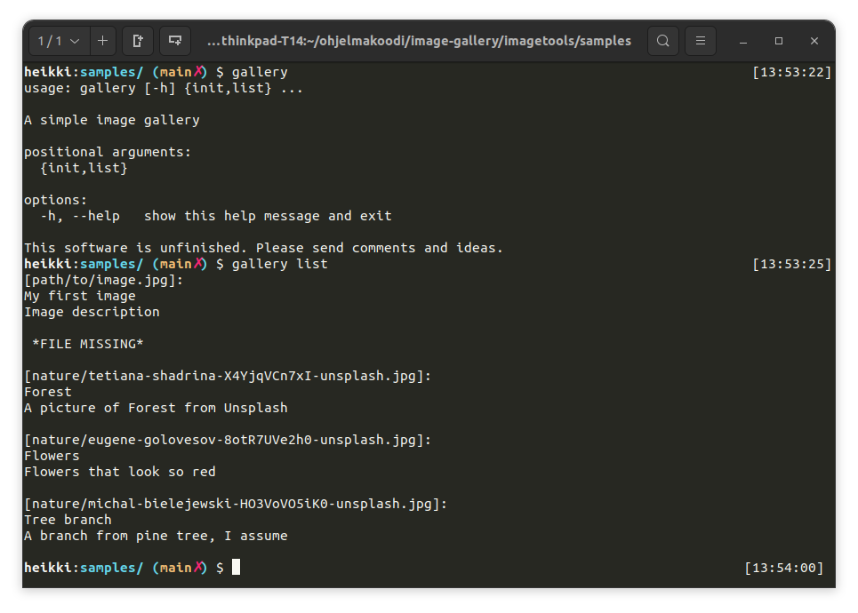
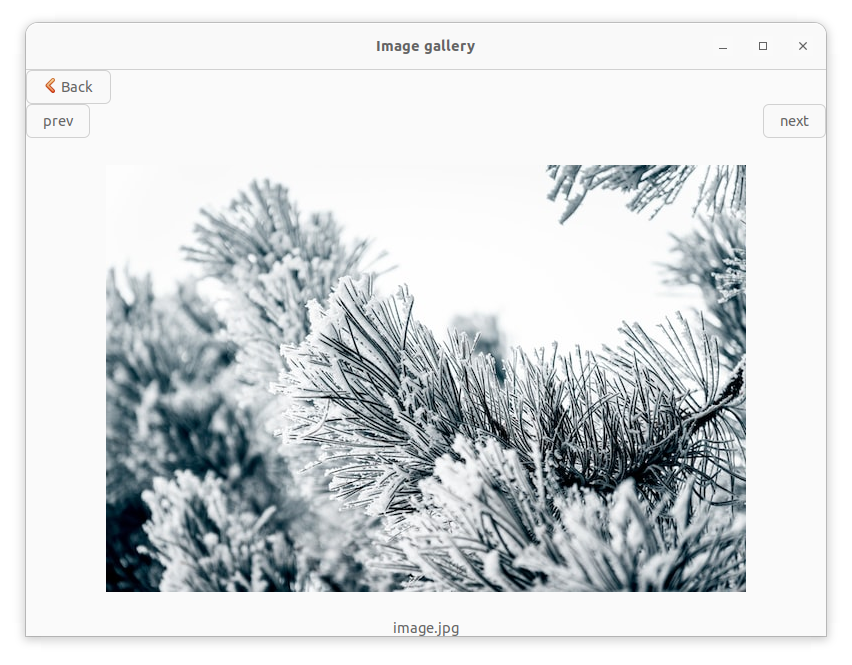

# gallery
## A simple image gallery

This image gallery is meant to be a minimalistic, simple and plain-text centric tool for your personal photo management.

## Useful links

 - [Installation](#installation)
 - [Why a world needs an UNIX-style image collection manager?](docs/why.md)
 - [Blog](docs/blog)

This project has three parts:

 * specification for a simple image gallery
 * command line tool for managing image gallery
 * simple viewer program

## gallery specification

Your image gallery is just a directory tree containing pictures plus a gallery.toml file. An example directory tree could look like this:
```
~/Pictures/gallery/
├── 2021
│   └── 12
│       └── 15
│           └── image1.png
├── 2022
│   ├── 01
│   │   └── 15
│   │       └── image2.png
│   └── 03
│       └── 02
│           └── image3.jpg
└── gallery.toml
```

In this image gallery pictures are organized to `year-month-day` directory structure. You can use whatever structure you want, of course.

### gallery.toml fileformat

All the metadata is saved to a gallery.toml file. It looks like this:

```
["Wallpapers/Studio_Ghibli_Laputa_Laputa_Castle_in_the_Sky_Movie_Screenshots_far_view_anime_animated_movies-1845525.jpg"]
title = ""
description = ""
tags = ['movie', 'Laputa']

["holiday pictures/IMG_20220301_130811.jpg"]
title = "In the forest"
description = ""
tags = ['nature', 'forest']

["holiday pictures/IMG_20220301_132625.jpg"]
title = "A huge tree"
description = ""
tags = ['nature', 'tree', forest]

["holiday pictures/IMG_20220301_132650.jpg"]
title = "Nice rock"
description = "This is a nice rock I found"
tags = ['nature', 'rock']

```

Basically you just reference every image with its path and then give it title, description and tags. This file is easy to write by hand and pretty human-readable as well, but you can also generate and handle it automatically.

The idea here is that the whole gallery.toml is easily hackable so you (or others) can extend the system however you like.

## gallery command



There is a simple, alpha-level utility called `gallery` that can be used to manipulate this gallery. Currently it has two functions.

### gallery list
This command lists all the pictures in the gallery.toml. It checks that every image really exists on the disk and prints out *** FILE MISSING *** for ones that don't exist. Just go to the directory where gallery.toml sits and issue this command there.

You can also filter pictures by tag:

`gallery list --tag nature`
This gives you a list of all pictures tagged "nature".

### gallery init
This command creates a new gallery.toml by collecting all the image files from the current work directory and its subdirectories. It does not save the file anywhere but only prints its contents out. You can easily create a gallery.toml file by piping results into file. Following command overwrites an earlier gallery.toml.

```
gallery init > gallery.toml
```

## gallery-viewer (GTK)



gallery-viewer is a simple GTK-based program that can be started from command line and used to view images in the gallery. Start the program in the same directory that contains a gallery.toml file.

gallery-viewer currently just lists all collections and allows to view images in each collection.

In order to function gallery-viewer needs python3 installed in the host system as well as PyGobject library.

## <a name="installation"></a>Installation

You can install this program by just downloading a binary file from releases and running it on your computer.

If you don't know how to do that, there's also an deb-installation package for Ubuntu and probably other Debian-like operating systems.

[Head to releases and download this!](releases)

### Installing PyGObject

**In Ubuntu (and hopefully Debian as well):**
Install following packages: `python3-gi python3-gi-cairo gir1.2-gtk-3.0`

**In Fedora:**
Install following packages: `python3-gobject gtk3`

You can find more information and help about installing PyGObject from their official documentation: https://pygobject.readthedocs.io/en/latest/getting_started.html

## Technical details

This software is written in Python. Binaries are self-containing and self-extracting python archives. They are made with a tool called `shiv`. When ran, they create a hidden directory `~/.shiv` and download needed dependencies inside that.


## Want to contribute?
I value that greatly! Head on to [CONTRIBUTING.md](./CONTRIBUTING.md) to find out how to build the project.
